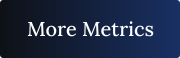

# About me

- 🥰 Pronouns: he/him
- 👨🏻‍💻 I'm iOS developer intern at Apple Developer Academy | IFCE.
- 👨🏻‍🎓 I'm currently studying Computer Engineering at Instituto Federal de Educação, Ciência e Tecnologia do Ceará ([IFCE](https://ifce.edu.br/fortaleza))
- 📖 I’m currently learning about: 
  + 🛠️ Backend Development;
  +  iOS Development;
  + 💻 Machine Learning;
  + 📊 Data Science;

## Analytics & Highlights

### Contact me:

 
